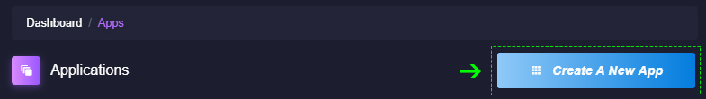

# 應用程式部署

### 相關要求

* [註冊](https://https://console.colyseus.io/register) 一個 Arena Cloud 帳戶
* 相容於 [Arena Cloud](../create-colyseus-server/) 的 Colyseus 伺服器

## 建立一個應用程式部署

您的遊戲或應用程式可以有諸多應用程式部署, 其可用於分隔您的環境 (Dev, Staging, Prod)和/或區域 (美國東部, 歐盟西部, 亞太地區南部). 每個應用程式部署都有自身專屬的資源池, 並可在您帳戶管理的其他部署中獨立運作.

若要開始建立您的第一個應用程式部署...

- 登入後, 選擇儀錶板右上角的 **建立一個新的應用程式** .

- 填寫申請詳情欄位並選擇您的 *計劃* 和 *地區*

- 若您的搶先體驗電子郵件中提供了 **Arena 代碼**, 請在 *代碼* 欄位中輸入該代碼.

- 提交並等待您的應用程式建立

!!! NOTE
    新應用程式部署最多可能需要 2 分鐘, 具體取決於所選區域
    For Early Access users you *MUST* use the provided Arena **CODE** to create a new app

## 應用程式儀錶板

在您新建立的應用程式上選擇 **管理** , 即可查看您的應用程式儀錶板. 從這裡, 您可以看到您的活動快照和存取工具; 透過各項工具, 您可以更新代碼, 查看活動伺服器, 重新啟動您的應用程式和查看日誌.

- **目前的使用情況:** 顯示目前 CCU 以及您目前的 Arena 計劃限制 (如果有)
- **連結:** 可存取您應用程式的 URL 和埠口
- **API 密鑰:** 應用程式的唯一參考識別碼, 可用於透過 Arena Public API 存取應用程式部署
- **Arena 計劃:** 您應用程式目前註冊的託管計劃.
- ***GIT 更新:*** GIT 近期更新的資訊.
- ***GIT 訊息:*** 近期更新的簽入訊息.
- ***GIT 哈希:*** 近期更新的哈希值.
!!! NOTE
    ***GIT*** 詳情 ***僅*** 在使用 CI/CD GitSync 服務 (為 Powered Ascent 和 Up Arena 計劃提供)時可見
