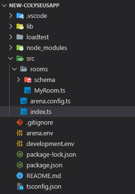

# 创建新的 Colyseus 服务器

**工具要求**:

- [下载并安装 Node.js](https://nodejs.org/) V12.0 或更高版本
- [下载并安装 Git SCM](https://git-scm.com/downloads)
- [下载并安装 Visual Studio Code](https://code.visualstudio.com/) （或您选择的其它编辑器）

## 创建 Colyseus 服务器表单 NPM 模板

使用 `npm init colyseus-app` 命令生成准系统 Colyseus 服务器. 您可以选择 TypeScript（推荐）和 JavaScript 作为服务器语言. **Arena Cloud** 目前仅支持两种语言.

```
npm init colyseus-app ./my-colyseus-app
```


- ONLY Complied **TypeScript** and **JavaScript (CommonJS)** are currently supported. *ESM support is coming soon.*

以下是在 *my-colyseus-app* 目录中为 TypeScript 服务器创建的预期文件夹结构和文件.



- **index.ts / js:** 此文件用于本地测试或自托管. 为确保 Arena Cloud 兼容性, 我们 ***建议*** 对于直接对索引文件 ***不要*** 进行更改. 当您的服务器托管在 Arena Cloud 上时, 此处添加的更改或功能将不会反映出来对于本地测试, 可以修改此文件以更改 Colyseus 服务器端口.

- **arena.config.ts / js:** 可以在此文件中进行添加和修改, 以支持您的游戏. 请注意, 在游戏服务器初始化期间, 将调用三个核心函数.

```
    getId: () => "Your Colyseus App",

    initializeGameServer: (gameServer) => {
        /**
         * Define your room handlers:
         */
        gameServer.define('my_room', MyRoom);

    },

    initializeExpress: (app) => {
        /**
         * Bind your custom express routes here:
         */
        app.get("/", (req, res) => {
            res.send("It's time to kick ass and chew bubblegum!");
        });

        /**
         * Bind @colyseus/monitor
         * It is recommended to protect this route with a password.
         * Read more: https://docs.colyseus.io/tools/monitor/
         */
        app.use("/colyseus", monitor());
    },


    beforeListen: () => {
        /**
         * Before before gameServer.listen() is called.
         */
    }
```


- **arena.env / development.env:** 这些文件用于管理 Colyseus 服务器环境变量, 在 Arena Cloud 上托管时, 将默认加载arena.env.

- **lib / upload Folder:** 只有在第一次运行 ```npm run build``` 命令后才会创建此文件夹. 此文件夹包含编译后的 JS 代码、package.json 和 .env 文件, 需要将这些文件上传到 Arena Cloud.
