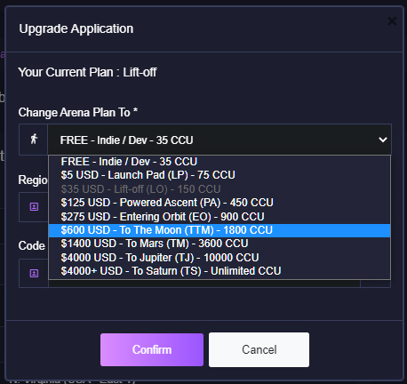

# Managing Application

## Overview
Your Arena Cloud application can be manage from this dashboard.

- You can edit your app title and description at anytime by clicking on the text.

- To view your full API key, click on the characters shown.

## App Config Interface

### Server Code
This interface provides you with an online IDE and uploader. From here you can edit your Colyseus source code and deploy it to your active game servers.

### Deployments
List of your active game servers and services on your Arena Cloud application. You can find logs and restart individual services from this interface.

### Upgrade Plan
This option allow you to upgrade/downgrade your Arena Cloud hosting plan. You changes are applied immediately and may effect currently in-progress game session.

### Restart App
Will restarted hard all Colyseus Servers and auto-scalers. It won't restart your Load Balancers or Git Sync service. This will end all game sessions and break existing player connections.

### Delete Application
This will permanently remove you Arena Cloud Application and all associated deployments. If you have done this in error and would like to recover your delete application please reach out to our support team.

## Migrate Application To Another Region

This can be done via a support request. Contact us at [support@lucidsight.com](mailto:support@lucidsight.com) to initiate the request.