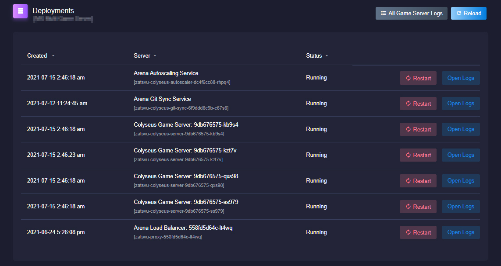

# 概述

## 访问 / 查看服务器和服务
在应用仪表板上选择 ***Deployments***, 可以查看您的 Arena Cloud 应用关联的各个服务器和服务.

## 部署仪表板

在此界面上, 可以访问日志还可以重启各个 Arena Cloud 应用服务.

- ***Colyseus Game Server (游戏服务器):*** 已部署的运行着您的代码的 Colyseus 游戏服务器. 可以访问每个服务器的日志或使用右上角的 **All Game Server Logs** 按钮查看所有 Colyseus 游戏服务器日志.

- ***Arena Git Sync Service (Arena Git 同步服务):*** 从指定 Git 托管库同步和部署服务器代码的 Arena 应用 *(仅支持 Powered Ascent (PA) 计划及更高版本).*

- ***Arena Load Balancer (Arena 负载均衡器):*** 此服务管理传入连接, 并将它们分发给正确的 colyseus 服务器. 在多个游戏服务器之间创建房间以平衡负载 *(仅适用于自动容量缩放的多服务器部署, To Mars (TM) 计划及更高版本).*
!!! NOTE
      - 重新启动此服务将中断所有现有连接, 从而断开玩家与游戏服务器的连接. 仅当在负载均衡器中遇到错误/异常, 并且游戏客户端无法连接时, 才应执行此操作.
      - 当 CCU 流量超过 10,000 名玩家时, 可能会看到多个 *Arena 负载均衡器*.

- ***Arena Autoscaling Service (Arena 自动容量缩放服务):*** 管理 Colyseus 游戏服务器的扩容和缩容. 此服务保证有玩家连接的游戏服务器不被缩容 *(仅适用于自动容量缩放的多服务器部署, To Mars (TM) 计划及更高版本).*

