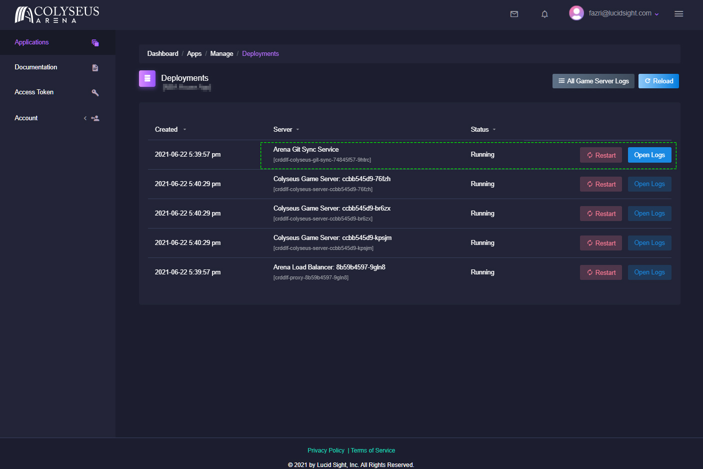

# GitSync（PA 及更高版本）

### 要求

* 仅适用于 **Powered Ascent** 计划及更高版本。

## 设置您的配置文件

要配置 git sync，需要将以下 ```arena.gitsync.json``` JSON 文件添加到服务器代码的根文件夹并将其部署到您的应用。 

同步服务大约每 2 分钟拉取一次 Git 存储库，以在请求的分支中进行新签入。 

## Example of arena.gitsync.json 示例
```
{
    "serverDir": "upload",
    "buildType": "arena",
    "gitServer": "github.com/Lucid-Sight-Inc/testsyncrepo.git",
    "gitUser": "USER",
    "gitPassword": "PASS",
    "branch" : "testbranch",
    "redeployOnChange": true,
    "overrideGitURL": "",
    "repoReset" : false
}
```

**JSON Attributes:**

- **serverDir:**这是上传代码所在的存储库根目录的位置。如果使用“npm run build”创建部署代码，应该列出此命令将文件所输出到的目录。

- **buildType:**此属性有两个选项。 
    - `arena` \- 在尝试从 serverDir 复制文件之前运行 ```npm install && npm run build```。 
    - `none` \- 直接从 serverDir 文件夹复制文件，无需运行任何构建命令。如果在签入之前已经编译并准备好在 Arena Cloud 上运行服务器代码，请使用此选项。

- **gitServer:**您的 git 存储库 url。

- **gitUser:**至少拥有存储库读取权限的用户帐户。

- **gitPassword:**密码 ***(Password MUST BE URL encoded if it has any special characters)***

- **branch:**要从中提取文件的分支名称。

- **redeployOnChange:**如果为 true，新代码将立即部署到游戏服务器并重新启动，从而结束这些服务器上的所有现有游戏（将在接下来的几周内实施合理的滚动更新）。

- **overrideGitURL: ** 针对您的存储库的任何非标准/非 https URL（我们不建议使用此选项）。

- **repoReset:**这将在 git 同步服务器上强制删除存储库的本地副本。如果要将存储库更改为指向新位置，这将非常有用。您需要保存它并持续一个更新周期，然后才能将其关闭。

## 检查状态

可以使用应用信息中心的***Deployments（部署）***区域检查同步状态或查找任何错误。选择服务器标签旁边的日志 **Git Sync Service（Git 同步服务）**，可以查看最近的日志/错误。



## 故障排除
如果在同步过程中遇到合并冲突或其他未知/严重错误，建议您在 **Git Sync Service** 的部署屏幕上选择 **Restart**。重新启动 GitSync 服务将清除本地存储库，并在重新启动时拉出一个新副本。
