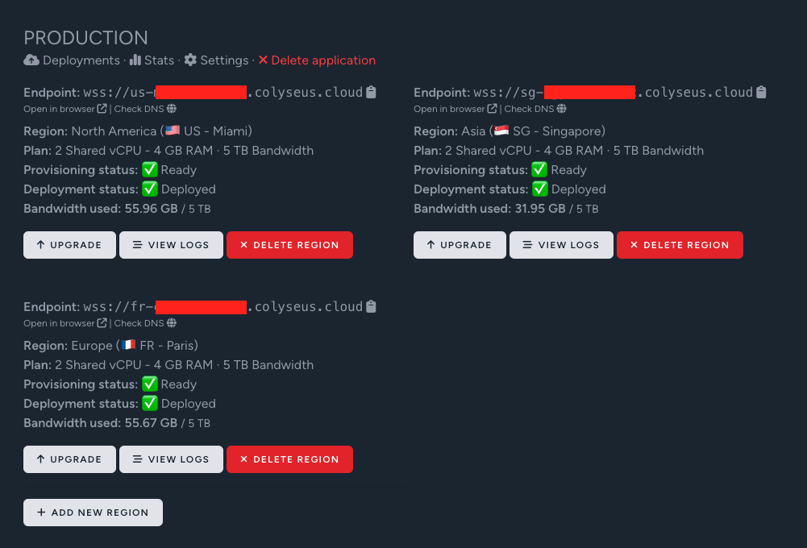
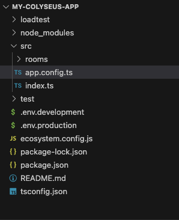

# Welcome to Colyseus Cloud

[Colyseus Cloud](https://cloud.colyseus.io/) provides a managed infrastructure for your Colyseus application.



## Project template

In order to deploy your Colyseus application to Colyseus Cloud, you need to follow the project template from `npm create colyseus-app@latest` command:

<center>

</center>

The key important configurations the template provide are:

1. Usage of `@colyseus/tools` to start the application
2. An `ecosystem.config.js` file at the root of the project (with the `"script"` pointing to your application's entrypoint)

=== ":octicons-file-code-16: `src/index.ts`"

    ```typescript hl_lines="1 7"
    import { listen } from "@colyseus/tools";

    // Import Colyseus config
    import app from "./app.config";

    // Create and listen on 2567 (or PORT environment variable.)
    listen(app);
    ```

=== ":octicons-file-code-16: `src/app.config.ts`"

    ```typescript
    import config from "@colyseus/tools";
    import { MyRoom } from "./rooms/MyRoom";

    export default config({
        initializeGameServer: (gameServer) => {
            gameServer.define('my_room', MyRoom);
        },
        initializeExpress: (app) => {
            // ...
        },
        beforeListen: () => {
            // ...
        }
    });
    ```

=== ":octicons-file-code-16: `ecosystem.config.js`"

    ```typescript hl_lines="6"
    const os = require('os');

    module.exports = {
        apps : [{
            name: "colyseus-app",
            script: 'build/index.js',
            time: true,
            watch: false,
            instances: os.cpus().length,
            exec_mode: 'fork',
            wait_ready: true,
            env_production: {
                NODE_ENV: 'production'
            }
        }],
    };
    ```

---

## Deploying your application

From your terminal, run the following command to deploy your application to Colyseus Cloud.

=== ":octicons-terminal-16: Terminal"

``` bash
npx @colyseus/cloud deploy
```

You will be redirected to your browser, where you will be asked to select which application you want to deploy.

This will generate a `.colyseus-cloud.json` file at the root of your project with credentials capable of deploying your application in the future. Keep this file safe!

### Available command-line options:

- `--env [env]`: The deployment environment. Default is `production`. (The `.colyseus-cloud.json` file stores the configuration per environment.)
- `--remote [remote]`: Force a specific git remote to deploy from. Value is stored on `.colyseus-cloud.json`
- `--branch [branch]`: Force a specific git branch to deploy from. Value is stored on `.colyseus-cloud.json`
- `--reset`: Reset application selection for deployment
- `--preview`: Open web interface to preview the deployment.

---

## Customizing build steps

If you need to run custom build steps before deploying your application, you can customize the `build` script to your `package.json` file.

```json hl_lines="3"
{
  "scripts": {
    "build": "your custom build steps here"
  }
}
```

---

## Environment Variables and Secrets

Colyseus Cloud allows you to safely store your secrets and environment variables via Application Settings page:


Values are encrypted and only visible to team members of your application.

!!! Warning "Do not commit your secrets to your repository!"
    When you commit a secret key to your repository, it is exposed to anyone with access to your repository. This can lead to your account being compromised, and your keys being used maliciously.

---

### Development and Production environments

Colyseus loads your `.env` files automatically, depending on the `NODE_ENV` environment variable. The usage of `.env` files is optional.

- `.env.development`: When testing from your local machine
- `.env.production`: When deployed to Colyseus Cloud
- `.env.{REGION}.production`: When deployed to Colyseus Cloud, depending on the region where your server has been provisioned. Region-based environment variables have precedence over `.env.production`.

---

### Region-based Environment Variables

Colyseus Cloud provides region-based environment variables, depending on where your application is deployed:

- `process.env.REGION` - the region where your server has been provisioned.
- `process.env.COUNTRY` - the country where your server has been provisioned.

#### Region codes

| Region | `process.env.REGION` |
|-|-|
| Europe | `'EU'` |
| North America | `'NA'` |
| Asia | `'AS'` |
| Africa | `'AF'` |
| Australia | `'AU'` |
| South America | `'SA'` |

#### Country codes

| Country | `process.env.COUNTRY` |
|-|-|
| Australia | `'AU'` |
| Brazil | `'BR'` |
| Canada | `'CA'` |
| Chile | `'CL'` |
| Germany | `'DE'` |
| Spain | `'ES'` |
| France | `'FR'` |
| United Kingdom | `'GB'` |
| Israel | `'IL'` |
| India | `'IN'` |
| Japan | `'JP'` |
| South Korea | `'KR'` |
| Mexico | `'MX'` |
| Netherlands | `'NL'` |
| Poland | `'PL'` |
| Sweden | `'SE'` |
| Singapore | `'SG'` |
| United States | `'US'` |
| South Africa | `'ZA'` |
