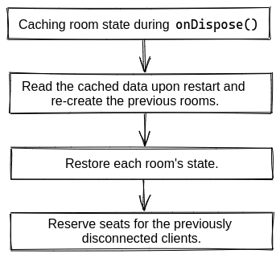

### How it works?

The `devMode` option has been introduced to speed up **local development** when you're updating your server code.

Whenever you update your server code, before the server restarts, all active rooms are cached locally, including their state and sessionId's of previously connected clients (seat reservations). After the restart, all rooms are recreated and the cached state is restored.

The clients are going to try to reconnect as soon as the server goes down, and keep trying a few times until they are successful, or the attempt limit is reached.



_(The client-side code is not reloaded, only the connection is re-established)_

---

### Enabling `devMode`

The `devMode` is **disabled** by default and it can be enabled via [Server option](/colyseus/server/api/#optionsdevmode):

```typescript fct_label="Self-hosted"
import { Server } from "colyseus";

const gameServer = new Server({
  // ...
  devMode: true
});
```

```typescript fct_label="arena.config.ts"
import Arena from "@colyseus/arena";

export default Arena({
    // ...
    options: {
        devMode: true
    },
    // ...
});
```

!!! Note "Attention on the client-side"
    Upon re-establishing a connection on devMode, the `onAdd` schema callback will be triggered again on the client-side.
    Be prepared to possibly ignore it during development.

!!! Warning "Do not use `devMode` in production!"
    This feature is very costly and is not optimized for a large amount of rooms. Use it for local development only. (Arena hosting does not support this feature)

---

### Restoring data outside the room's `state`

- By default, only the `state` of the room is cached and restored when the server restarts.
- You can restore data outside the room's `state` by implementing the `onCacheRoom()` and `onRestoreRoom()` methods.
- Only JSON-serializable data is allowed.

---

#### `onCacheRoom`

The `onCacheRoom` will be executed before the room is cached and disposed.

```typescript fct_label="JavaScript"
export class MyRoom extends Room<MyRoomState> {
  // ...

  onCacheRoom() {
    return { foo: "bar" };
  }
}
```

---

#### `onRestoreRoom`

The `onRestoreRoom` will be executed after the room has been restored and the restored state is available.

The argument provided for the `onRestoreRoom` is the data previously returned by the `onCacheRoom` method.

No clients are connected yet at this point.

```typescript fct_label="JavaScript"
export class MyRoom extends Room<MyRoomState> {
  // ...

  onRestoreRoom(cachedData: any): void {
    console.log("restoring room", cachedData);

    this.state.players.forEach(player => {
      player.method(cachedData["foo"]);
    });
  }
}
```