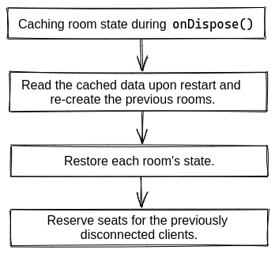

### 工作原理?

引入稱作 `devMode` 的參數以便您在 **本地開發** 更新服務端代碼時, 能更加方便快捷地叠代.

當更新妳的服務端代碼時, 在服務器重啓之前, 所有活動房間都被保存在本地緩存中, 包括它們的 state 和之前已連接客戶端的 sessionId (seat reservations). 服務器重啓之後, 所有房間和緩存的 state 都會自動重建.

壹旦服務端關閉, 客戶端會持續進行重連嘗試, 直到重連成功, 或者達到最大重連次數.



_(客戶端代碼並不重載, 只有連接進行重建)_

---

### 開啓 `devMode`

默認 `devMode` 是 **disabled** 狀態, 可以通過 [Server option](/colyseus/server/api/#optionsdevmode) 打開:

```typescript fct_label="Self-hosted"
import { Server } from "colyseus";

const gameServer = new Server({
  // ...
  devMode: true
});
```

```typescript fct_label="arena.config.ts"
import Arena from "@colyseus/arena";

export default Arena({
    // ...
    options: {
        devMode: true
    },
    // ...
});
```

!!! Note "注意客戶端"
    在 devMode 中重建連接後, `onAdd` schema 回調會在客戶端再次觸發.
    開發時可能需要您自己忽略它.

!!! Warning "不要在生産環境下使用 `devMode`!"
    該功能影響性能而且對于大量房間沒有進行優化. 請確保只在本地開發環境中使用. (Arena 托管並不支持該功能)

---

### 恢複 `state` 之外的數據

- 默認情況下, 只有 room 的 `state` 被緩存並在服務器重啓時重建.
- 可以使用實現 `onCacheRoom()` 和 `onRestoreRoom()` 函數重建 `state` 之外的數據.
- 只能重建 JSON-serializable 的數據.

---

#### `onCacheRoom`

Room 被緩存與銷毀之前, `onCacheRoom` 會被調用.

```typescript fct_label="JavaScript"
export class MyRoom extends Room<MyRoomState> {
  // ...

  onCacheRoom() {
    return { foo: "bar" };
  }
}
```

---

#### `onRestoreRoom`

Room 被重建並且 state 被恢複之後, `onRestoreRoom` 會被調用.

爲 `onRestoreRoom` 提供的參數就是前面 `onCacheRoom` 執行完返回的數據.

此時沒有客戶端建立連接.

```typescript fct_label="JavaScript"
export class MyRoom extends Room<MyRoomState> {
  // ...

  onRestoreRoom(cachedData: any): void {
    console.log("restoring room", cachedData);

    this.state.players.forEach(player => {
      player.method(cachedData["foo"]);
    });
  }
}
```