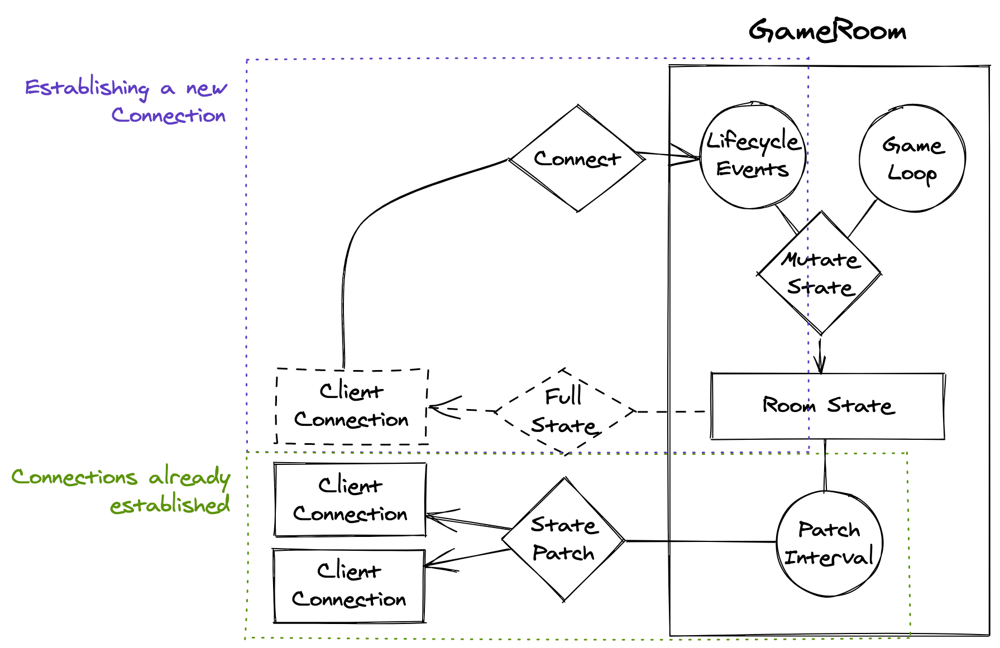

# State Synchronization

Colyseus handles state synchronization automatically through its strongly-typed `Schema` structures.

### How does it work?

- When the user successfully joins the room, they receive the full state from the server.
- At every [patchRate](/server/room/#patchrate-number), binary patches of the state are sent to every client (`50ms` by default)
- [schema callbacks](/state/schema/#callbacks) are triggered on client-side when applying patches coming from the server.
- [`onStateChange`](/client/room/#onstatechange) is triggered after all latest patches have been applied in the client.
- Your server-side logic may mutate the room state at any moment. Connected clients are always ensured to be in sync with the server.

