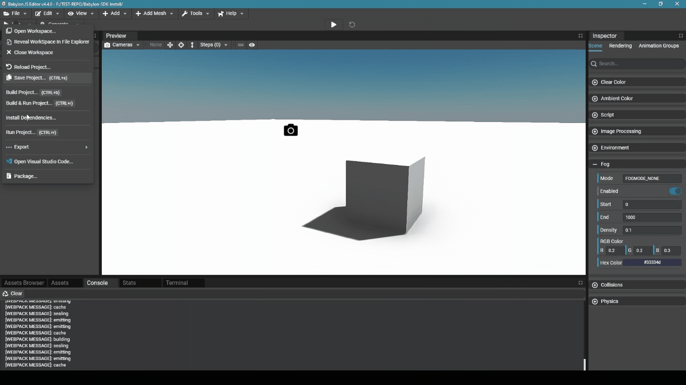

# Babylon.js Editor

The installation process very much follows the same steps as for a standard JavaScript or Typescript project.
To install the Colyseus client SDK in the Babylon.js Editor open a terminal and navigate to the root of the folder that is the workspace of the Babylon.js Editor. [Follow the first set of instructions to install with npm under the "Usage" section.](/getting-started/javascript-client/#usage){target=_blank}

The remaining usage instructions all apply to the Babylon.js Editor environment.

