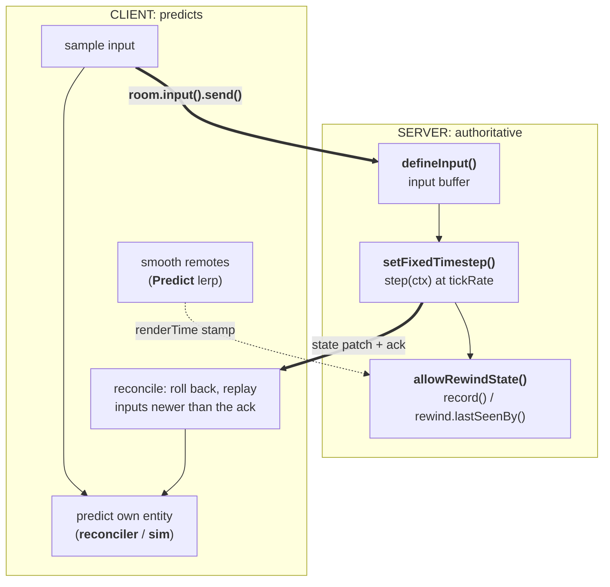

import { Callout, Cards } from 'nextra/components'
import { ServerIcon, DevicesIcon, GoalIcon, ChecklistIcon, BeakerIcon } from '@primer/octicons-react'
import { PremiumDemos, premiumDemos } from '../components/premium-demos'

# Netcode

Fast-paced games can't wait for the network. If your character only moves after a round-trip to the server, controls feel underwater. But if the client simply moves itself, the server is no longer in charge and cheating becomes trivial.

Colyseus 0.18 gives you both: the server stays authoritative, and the client **predicts**. Your own movement responds instantly, remote players move smoothly, and hits register against what you saw on screen. The framework runs the prediction, reconciliation, and rewind loops. You supply the deterministic step function.

<Callout type="info">
    **Available in Colyseus 0.18+.** These APIs (`room.input()`, `Predict`, `defineInput()`, `setFixedTimestep()`, `allowRewindState()`) are new in 0.18 and have no equivalent in earlier versions.
</Callout>

## The mental model

The stack is one loop split across the server and the client. Each half is configured independently, but they only make sense together:

- The **server** runs the authoritative simulation at a **fixed tick rate**.
- The **client predicts** its own entity by running the same step function locally. When the server's authoritative state arrives, it **reconciles**: roll back, replay the inputs the server hasn't processed yet, and smoothly correct any mismatch.
- **Remote** entities are smoothed from the server stream (interpolated a little in the past, or dead-reckoned forward).
- For hits, the server **rewinds** other entities to where the shooter *saw* them (their render time). That way, a well-aimed shot at a moving target registers.

> One input per fixed step; one `predict.tick()` per render frame drives everything.

## Which primitive for which interaction?

Every interaction in your game maps onto a small set of primitives. Find the row that matches, then jump to the page that documents it:

| Interaction | Primitive | Page |
|---|---|---|
| Your own movement (one entity, flat fields) | `predict.reconciler` | [Client Prediction](/netcode/client-prediction) |
| Anything your inputs push / carry / throw (paddle + puck, vehicle + cargo) | `predict.sim` (composite scalars) | [Client Prediction](/netcode/client-prediction#composite--engine-state-predictsim) |
| Your movement inside a physics engine (Rapier/crashcat) | `predict.sim` (engine handle) | [Client Prediction](/netcode/client-prediction#composite--engine-state-predictsim) |
| Remote players you don't control | `Predict` `lerp` | [Client Prediction](/netcode/client-prediction#remote-entities) |
| Server-driven ballistics nobody touches | `Predict` `reckon` | [Recipes](/netcode/recipes) |
| Discrete events your timeline produces (a goal, a kill, a pickup) | `predict.defineEvent` + `ctx.predict` | [Client Prediction](/netcode/client-prediction#optimistic-events-defineevent) |
| Projectiles you spawn (predicted → authoritative handoff) | `predict.spawns` | [Recipes](/netcode/recipes#predicted-projectiles-predictspawns) |
| Hitscan against others (instantaneous, server-owned target) | `allowRewindState` + `rewind.lastSeenBy` | [Lag Compensation](/netcode/lag-compensation) |

## Read in order

New to prediction? Read top to bottom. Each page builds on the one before it:

<Cards>
  <Cards.Card icon={<ServerIcon />} title="Server Input & Timestep" href="/netcode/server-input" />
  <Cards.Card icon={<DevicesIcon />} title="Client Prediction" href="/netcode/client-prediction" />
  <Cards.Card icon={<GoalIcon />} title="Lag Compensation" href="/netcode/lag-compensation" />
  <Cards.Card icon={<ChecklistIcon />} title="Determinism & The Contract" href="/netcode/determinism" />
  <Cards.Card icon={<BeakerIcon />} title="Recipes" href="/netcode/recipes" />
</Cards>

## Runnable reference

The [**Prediction Playground**](https://prediction-colyseus.vercel.app/) covers this whole section as twelve small labs, each isolating one concept. Rollback and reconciliation, the interpolation modes, dead reckoning, lag compensation, optimistic events, predicted spawns, composite worlds. Every lab has a latency slider and visualizations of the SDK internals (server ghosts, pending-input chips, rewind markers). Each also shows the SDK-facing code it runs. The [source is on GitHub](https://github.com/colyseus/prediction-playground).

### Premium demos

The playground isolates each concept. These {premiumDemos.length} prototypes combine them: authoritative server, client prediction, smoothed remotes and lag compensation running as one stack. Each is playable in the browser.

The set is actively expanding, with new prototypes and with more engine ports of the existing ones. Air Hockey already ships Godot and Unity clients alongside its Three.js build.

<PremiumDemos />

<Callout type="info">
    Coming from the manual approach? The [Phaser tutorial](/learn/tutorial/phaser/linear-interpolation) builds prediction, interpolation, and a fixed tick rate **by hand** to teach the concepts. This section documents the built-in 0.18 API that does the same work for you.
</Callout>
