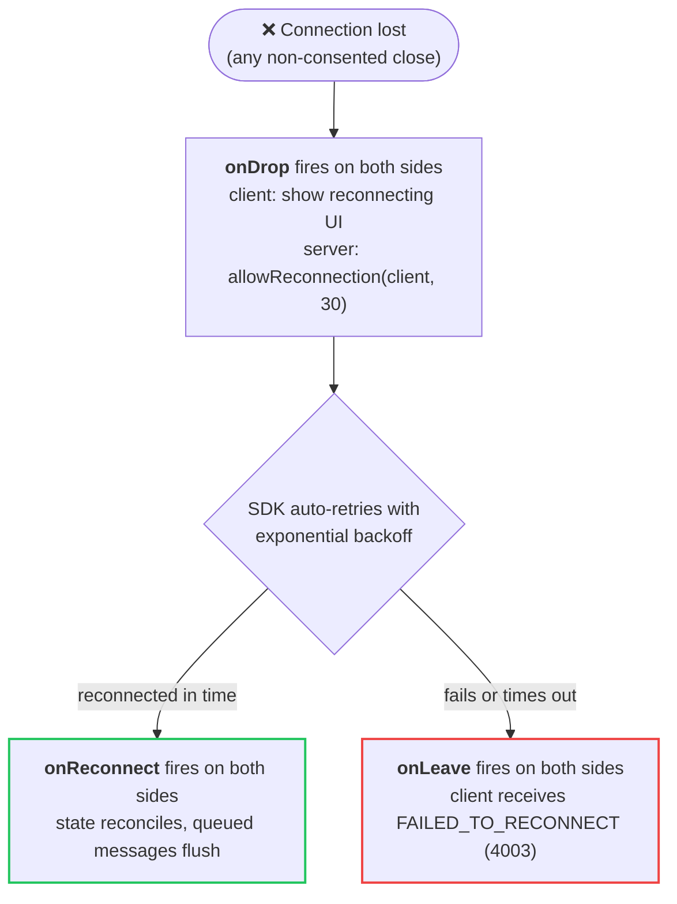

import { Callout, Tabs } from 'nextra/components'
import { MovedAnchors } from '../../components/moved-anchors'

# Reconnection

{/* Client-side reference consolidated into /sdk/connection; keep old deep links working. */}
<MovedAnchors map={{
    "roomondrop": "/sdk/connection#on-drop-event",
    "roomonreconnect": "/sdk/connection#on-reconnect-event",
    "roomonleave": "/sdk/connection#leaving-a-room",
    "complete-client-example": "/room/reconnection#client-side",
    "reconnection-options": "/sdk/connection#reconnection-options",
    "option-details": "/sdk/connection#reconnection-options",
    "message-buffering": "/sdk/connection#automatic-reconnection",
}} />

Colyseus supports two complementary reconnection flows. Both require the server to hold the client's seat via [`allowReconnection()`](#allowreconnectionclient-seconds):

- **[Automatic reconnection](#automatic-reconnection)**: the SDK detects the drop and retries with exponential backoff. The same `room` instance survives, so your listeners stay attached. Introduced in version 0.17.
- **[Manual reconnection](#manual-reconnection)**: the client rejoins later by calling `client.reconnect()` with a stored `reconnectionToken`. Use it when the app itself restarts (a page reload, an app switch on mobile) or after automatic retries give up. Available in all versions.

## Overview

When a client loses connection unexpectedly (e.g., network switch, temporary connectivity loss), the automatic flow works as follows:

1. **Client detects disconnection** → `onDrop()` is triggered on the client
2. **Server detects disconnection** → `onDrop()` is triggered on the server (if defined)
3. **Server allows reconnection** → Call `allowReconnection()` inside `onDrop()`
4. **Client attempts to reconnect** → Automatic retry with exponential backoff
5. **Reconnection succeeds** → `onReconnect()` is triggered on both client and server
6. **If reconnection fails/times out** → `onLeave()` is triggered on both sides



The automatic flow only covers drops the running client can recover from. A page reload or app restart destroys the client-side `room` object, so the SDK cannot retry by itself. In that case the client calls [`client.reconnect()`](#manual-reconnection) with a stored token instead. The server-side flow is identical.

---

## Server-Side

The backend handles both flows identically.

### `onDrop(client, code)`

Called when a client disconnects **without consent** (abnormal closure, network issues, etc.). This is where you should call `allowReconnection()` to allow the client to reconnect.

<Callout type="info">
    `onDrop()` is **optional**, but recommended for code clarity. You may implement the same functionality directly inside `onLeave()` by checking if the close code is `CloseCode.CONSENTED`. See [the alternative pattern](#alternative-handling-reconnection-in-onleave).
</Callout>

```typescript
import { Room, Client, CloseCode } from "colyseus";

class MyRoom extends Room {
  onDrop(client: Client, code: number) {
    // Allow the client to reconnect within 30 seconds
    this.allowReconnection(client, 30);

    // Optionally mark the player as disconnected in your state
    const player = this.state.players.get(client.sessionId);
    if (player) {
      player.connected = false;
    }
  }
}
```

**When `onDrop()` is called:** every non-consented disconnection. Abnormal closures (1006), browser/tab closed (1001), no close status (1005), dev-mode restarts (4010), server errors (4002), and custom close codes all qualify.

**When `onDrop()` is NOT called (goes directly to `onLeave()`):**
- `CloseCode.CONSENTED` (4000): Client called `room.leave()` with consent
- A reconnection already in progress was denied or failed

### `allowReconnection(client, seconds)`

Call this method inside `onDrop()` to hold the client's seat. The reservation covers both the SDK's automatic retries and a later manual `client.reconnect()`.

```typescript
// Allow reconnection for 30 seconds
this.allowReconnection(client, 30);

// Allow reconnection indefinitely (manual mode)
const reconnection = this.allowReconnection(client, "manual");

// Later, you can reject the reconnection manually
reconnection.reject();
```

**Returns:** A `Deferred<Client>` promise that resolves when the client reconnects or rejects if the timeout expires. Calling it without `await` is safe. The framework handles the timeout internally and routes the outcome to `onReconnect()` or `onLeave()`. Only `await` it inside a `try`/`catch`, as in [the `onLeave()` pattern below](#alternative-handling-reconnection-in-onleave).

**Choosing the window:** with a number of `seconds`, the seat expires by itself. With `"manual"`, the seat is held until your code calls `.reject()`. Manual mode suits players returning after a page reload or a long app switch. Pair it with your own give-up logic:

```typescript
onDrop(client: Client, code: number) {
  const reconnection = this.allowReconnection(client, "manual");
  const currentRound = this.state.currentRound;

  // In a real project, store `reconnection` on your Player instance and
  // perform this check from your game loop instead.
  client.userData.reconnectionInterval = this.clock.setInterval(() => {
    const missedRounds = this.state.currentRound - currentRound;
    if (missedRounds > 2) {
      reconnection.reject();
      client.userData.reconnectionInterval.clear();
    }
  }, 1000);
}

onReconnect(client: Client) {
  // clear the interval to avoid a dangling timer
  client.userData.reconnectionInterval?.clear();
  delete client.userData.reconnectionInterval;
}
```

### `onReconnect(client)`

Called when a client successfully reconnects after `allowReconnection()` held its seat, whether the SDK retried automatically or the client called `client.reconnect()`.

```typescript
class MyRoom extends Room {
  onReconnect(client: Client) {
    console.log(`Client ${client.sessionId} reconnected!`);

    // Restore the player's connected status
    const player = this.state.players.get(client.sessionId);
    if (player) {
      player.connected = true;
    }
  }
}
```

**Important:** The `client` object in `onReconnect()` has the same `sessionId` and preserves:
- `client.auth`: Authentication data
- `client.userData`: Custom user data
- `client.view`: View state (for filtered state)

The `client.reconnectionToken` will be different (new token generated for each connection).

### `onLeave(client, code)`

Called when a client **permanently** leaves the room. This happens when:
- Client calls `room.leave()` with consent
- Reconnection times out or fails
- Server explicitly disconnects the client

```typescript
class MyRoom extends Room {
  onLeave(client: Client, code: number) {
    console.log(`Client ${client.sessionId} left with code ${code}`);

    // Clean up player data
    this.state.players.delete(client.sessionId);
  }
}
```

---

## Complete Server Example

```typescript
import { Room, Client, CloseCode } from "colyseus";
import { MyState, Player } from "./MyState";

class GameRoom extends Room<{ state: MyState }> {
  state = new MyState();

  onJoin(client: Client, options: any) {
    const player = new Player();
    player.connected = true;
    this.state.players.set(client.sessionId, player);
  }

  onDrop(client: Client, code: number) {
    console.log(`Client ${client.sessionId} dropped (code: ${code})`);

    // Allow reconnection for 30 seconds
    this.allowReconnection(client, 30);

    // Mark player as disconnected (but don't remove them)
    const player = this.state.players.get(client.sessionId);
    if (player) {
      player.connected = false;
    }
  }

  onReconnect(client: Client) {
    console.log(`Client ${client.sessionId} reconnected!`);

    // Restore player connection status
    const player = this.state.players.get(client.sessionId);
    if (player) {
      player.connected = true;
    }
  }

  onLeave(client: Client, code: number) {
    console.log(`Client ${client.sessionId} left permanently (code: ${code})`);

    // Now it's safe to remove the player
    this.state.players.delete(client.sessionId);
  }
}
```

### Alternative: Handling Reconnection in `onLeave()`

Instead of using `onDrop()`, you can handle reconnection directly inside `onLeave()` by checking the close code. This approach consolidates all disconnection logic in a single method:

```typescript
class MyRoom extends Room {
  async onLeave(client: Client, code: CloseCode) {
    if (code !== CloseCode.CONSENTED) {
      try {
        // Wait for reconnection
        await this.allowReconnection(client, 30);
        console.log("Client reconnected!");
        return; // Don't clean up, client is back
      } catch (e) {
        // Reconnection failed or timed out
      }
    }

    // Clean up player
    this.state.players.delete(client.sessionId);
  }
}
```

Using separate `onDrop()` and `onReconnect()` methods is recommended for cleaner code separation, but both approaches are fully supported.

---

## Client-Side

### Automatic Reconnection

The SDK detects the drop, retries with exponential backoff, and fires three events. This is the whole client-side integration:

```typescript
import { Client, CloseCode } from "@colyseus/sdk";

const client = new Client("http://localhost:2567");
const room = await client.joinOrCreate("game_room");

room.onDrop((code, reason) => {
  // connection lost: the SDK is already retrying
  showReconnectingUI();
});

room.onReconnect(() => {
  hideReconnectingUI();
});

room.onLeave((code, reason) => {
  if (code === CloseCode.FAILED_TO_RECONNECT) {
    showError("Failed to reconnect. Please try again.");
  }
  cleanupGame();
});
```

Everything tunable here (retry and backoff options, disabling auto-reconnection, message buffering while offline) is documented in **[Connection Lifecycle & Reconnection](/sdk/connection#automatic-reconnection)**.

### Manual Reconnection

Automatic retries only help while the `room` object is still alive in memory. When the page reloads or the app restarts, resume the session with `client.reconnect(reconnectionToken)` instead:

- **Persist `room.reconnectionToken`** while connected. It is refreshed on every successful connection, so store it after joining *and* after each `onReconnect()`.
- **`client.reconnect()` returns a new `Room` instance**: reattach all listeners to it; the old references are gone.
- **The seat must still be held**: the call succeeds only within the server's `allowReconnection()` window (or indefinitely in `"manual"` mode).

```typescript
import { Client, Room } from "@colyseus/sdk";

const client = new Client("http://localhost:2567");

async function joinOrRejoin(): Promise<Room> {
  const token = sessionStorage.getItem("reconnectionToken");

  if (token) {
    try {
      // Try to resume the previous session first
      return onRoomJoined(await client.reconnect(token));
    } catch (e) {
      // Seat expired or reconnection was rejected: start fresh
      sessionStorage.removeItem("reconnectionToken");
    }
  }

  return onRoomJoined(await client.joinOrCreate("game_room"));
}

function onRoomJoined(room: Room): Room {
  sessionStorage.setItem("reconnectionToken", room.reconnectionToken);

  room.onReconnect(() => {
    // the token is refreshed on every successful connection
    sessionStorage.setItem("reconnectionToken", room.reconnectionToken);
  });

  // ...attach your onMessage / state callbacks here...

  return room;
}
```

Manual reconnection is also the fallback after automatic retries give up: on `FAILED_TO_RECONNECT` (4003), offer the player a "Rejoin" button that calls `client.reconnect()` with the stored token.

<Callout type="info">
    Samples for the other SDK languages are in **[Connection Lifecycle & Reconnection → Manual Reconnection](/sdk/connection#manual-reconnection)**.
</Callout>

---

## State After Reconnection

On a successful reconnection the server sends a **full state snapshot**, and the SDK **reconciles** it into the state tree you already hold (it does not rebuild the tree from scratch):

- Entities that changed while you were offline are **updated in place**. Your references into the tree and any state callbacks you attached stay valid. There is nothing to re-subscribe.
- Entities **added** while you were offline arrive as ordinary additions: `onAdd` fires.
- Entities **deleted** (or hidden from your view) while you were offline are **pruned**: `onRemove` fires for each, exactly as if the removal had arrived live.

In other words, after `onReconnect()` the state is guaranteed to match the server again, and your existing callbacks and UI bindings observe the offline gap as a normal sequence of changes. Prediction controllers follow automatically too. The SDK resets the input handle on reconnect and observing reconcilers pick it up; see [Client Prediction](/netcode/client-prediction).

<Callout type="info">
    After a **manual** `client.reconnect()`, there is no previous tree to reconcile into. The new `Room` instance receives the snapshot as its initial state, and your freshly attached callbacks fire from scratch.
</Callout>

---

## Close Codes Reference

| Code | Name | Description |
|------|------|-------------|
| 1000 | `NORMAL_CLOSURE` | Normal WebSocket closure |
| 1001 | `GOING_AWAY` | Browser/tab closing |
| 1005 | `NO_STATUS_RECEIVED` | No status in close frame |
| 1006 | `ABNORMAL_CLOSURE` | Connection closed unexpectedly |
| 4000 | `CONSENTED` | Client left with consent (`room.leave()`) |
| 4001 | `SERVER_SHUTDOWN` | Server graceful shutdown (production) |
| 4002 | `WITH_ERROR` | Closed due to an error |
| 4003 | `FAILED_TO_RECONNECT` | All reconnection attempts failed |
| 4010 | `MAY_TRY_RECONNECT` | Server shutdown in dev mode (allows reconnect) |

See the [full table of WebSocket close codes](/room#table-of-websocket-close-codes) for the complete range breakdown.

---

## Best Practices

1. **Always call `allowReconnection()` in `onDrop()`** if you want to support reconnection
2. **Don't remove player data in `onDrop()`**: wait for `onLeave()` to clean up
3. **Mark players as "disconnected" in state** so other clients can show appropriate UI
4. **Set reasonable reconnection timeouts** based on your game type (e.g., 30s for fast-paced games, 5min for turn-based)
5. **Persist `room.reconnectionToken`** (e.g., in `sessionStorage`) after joining and after each reconnection, so a page reload can resume via `client.reconnect()`
6. **Handle `FAILED_TO_RECONNECT` on the client** to show appropriate error messages, and offer a manual "Rejoin"
7. **Buffer important actions**: messages sent during disconnection are [queued automatically](/sdk/connection#automatic-reconnection)
